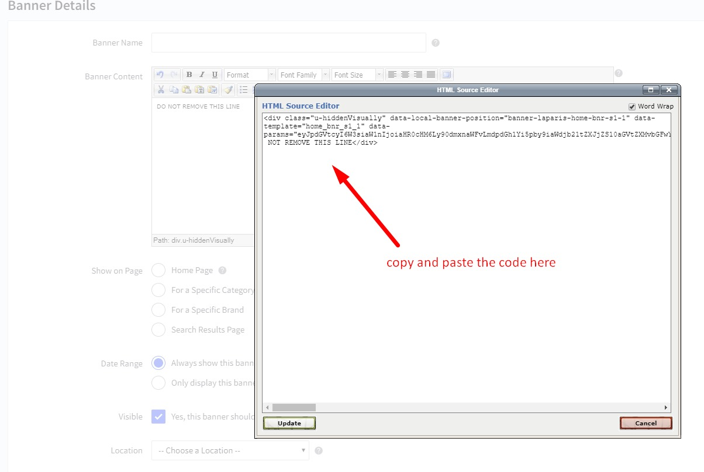

# Fashion Style 

## Home Page Section

## --- Sections Manager

You can select the sections displayed on the homepage (maximum 11 sections) in **Theme Editor** > **Homepage** > **Sections**.

### List of available sections key: ###

* **fashion-banner**
* **fashion-product-tab**
* **fashion-banner-product-slider**
* **fashion-catalogue**
* **fashion-review**
* **fashion-blogs**
* **fashion-brands**

## --- Feellio Fashion Banner Section

To edit content and images of banners, Open the link below on your web browser: [https://bc-feellio-builder.papathemes.com/](https://bc-feellio-builder.papathemes.com/)

Chooes the tab __Feellio Fashion Banner Section__ and Enter all required info on the form.

- Create a new banner in __Marketing__ > __Banners__ > click __Create a Banner__ button.
- Click button __HTML__ in __Banner Content__ editor to show __HTML Source Editor__.
- Copy and paste the code above to __HTML Source Editor__. Then click __Update__ button:

Set Show on __Page = Home Page__ and __Location = Top of Page__:

## --- Feellio Fashion Products tab Section

Fashion Products tab displays on the Home page can be chooes section **Fashion Products tab** in **Home page** > **Section**.

You can configure Products tab 1 settings in **Theme Editor** > **Home Page Section** > **Products tab 1**.

A few configs only working at the section that this section on section demo has these configs.

## --- Feellio Fashion Banner Product Slider Section

To edit content and images of banners, Open the link below on your web browser: [https://bc-feellio-builder.papathemes.com/](https://bc-feellio-builder.papathemes.com/)

Chooes the tab __Feellio Fashion Banner Product Slider Section__ and Enter all required info on the form.

- Create a new banner in __Marketing__ > __Banners__ > click __Create a Banner__ button.
- Click button __HTML__ in __Banner Content__ editor to show __HTML Source Editor__.
- Copy and paste the code above to __HTML Source Editor__. Then click __Update__ button:

Set Show on __Page = Home Page__ and __Location = Top of Page__:

## --- Feellio Fashion Catalogue Section

To edit content and images of banners, Open the link below on your web browser: [https://bc-feellio-builder.papathemes.com/](https://bc-feellio-builder.papathemes.com/)

Chooes the tab __Feellio Fashion Catalogue Section__ and Enter all required info on the form.

- Create a new banner in __Marketing__ > __Banners__ > click __Create a Banner__ button.
- Click button __HTML__ in __Banner Content__ editor to show __HTML Source Editor__.
- Copy and paste the code above to __HTML Source Editor__. Then click __Update__ button:

Set Show on __Page = Home Page__ and __Location = Top of Page__:

## --- Feellio Fashion Review Section

To edit content and images of banners, Open the link below on your web browser: [https://bc-feellio-builder.papathemes.com/](https://bc-feellio-builder.papathemes.com/)

Chooes the tab __Feellio Fashion Review Section__ and Enter all required info on the form.

- Create a new banner in __Marketing__ > __Banners__ > click __Create a Banner__ button.
- Click button __HTML__ in __Banner Content__ editor to show __HTML Source Editor__.
- Copy and paste the code above to __HTML Source Editor__. Then click __Update__ button:

Set Show on __Page = Home Page__ and __Location = Top of Page__:

## --- Feellio Fashion Blog Section

Fashion Blog Section displays on the Home page can be chooes section **Fashion Blog** in **Home page** > **Section**.

You can configure Fashion Blog settings in **Theme Editor** > **Home Page Section** > **Blog**.

A few configs only working at the section that this section on section demo has these configs.

## --- Feellio Fashion Brands Section

To edit content and images of banners, Open the link below on your web browser: [https://bc-feellio-builder.papathemes.com/](https://bc-feellio-builder.papathemes.com/)

Chooes the tab __Feellio Fashion Brands Section__ and Enter all required info on the form.

- Create a new banner in __Marketing__ > __Banners__ > click __Create a Banner__ button.
- Click button __HTML__ in __Banner Content__ editor to show __HTML Source Editor__.
- Copy and paste the code above to __HTML Source Editor__. Then click __Update__ button:

Set Show on __Page = Home Page__ and __Location = Top of Page__:

