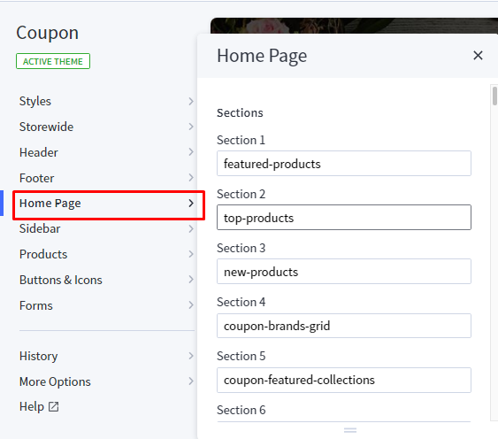
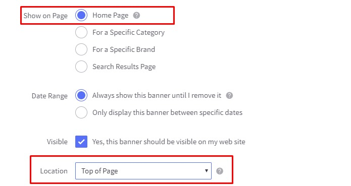

# Flowers Style

## Home Page Section

## --- Sections Manager

You can select the sections displayed on the homepage (maximum 11 sections) in **Theme Editor** > **Homepage** > **Sections**.

--- 

### List of available sections key: ###

* **flowers-banner**
* **flowers-about-us**
* **flowers-products-1**
* **flowers-products-2**
* **flowers-banner-parallax**
* **flowers-testimonial**
* **flowers-product-tab**
* **flowers-contact-info**
* **flowers-blogs**

## --- Feellio Flowers Five Banner Section

To edit content and images of banners, Open the link below on your web browser: [https://bc-feellio-builder.papathemes.com/](https://bc-feellio-builder.papathemes.com/)

Chooes the tab __Feellio Flowers Five Banner Section__ and Enter all required info on the form.

- Create a new banner in __Marketing__ > __Banners__ > click __Create a Banner__ button.
- Click button __HTML__ in __Banner Content__ editor to show __HTML Source Editor__.
- Copy and paste the code above to __HTML Source Editor__. Then click __Update__ button:

Set Show on __Page = Home Page__ and __Location = Top of Page__:

## --- Feellio Flowers About Us Section

To edit content and images of banners, Open the link below on your web browser: [https://bc-feellio-builder.papathemes.com/](https://bc-feellio-builder.papathemes.com/)

Chooes the tab __Feellio Flowers About Us Section__ and Enter all required info on the form.

- Create a new banner in __Marketing__ > __Banners__ > click __Create a Banner__ button.
- Click button __HTML__ in __Banner Content__ editor to show __HTML Source Editor__.
- Copy and paste the code above to __HTML Source Editor__. Then click __Update__ button:

Set Show on __Page = Home Page__ and __Location = Top of Page__:

## --- Feellio Flowers Products 1 Section

Flowers Products 1 displays on the Home page can be chooes section **Flowers Products 1** in **Home page** > **Section**.

You can configure Flowers Products 1 settings in **Theme Editor** > **Home Page Section** > **Products 1**.

**Product 1 sort by** you have 3 selection: **New products**, **Feature products**, **Top seller products**

Chooes the selection and setting in **Theme Editor** > **Home Page** > **New products**, **Feature products** or **Top seller products**.

A few configs only working at the section that this section on section demo has these configs.

## --- Feellio Flowers Products 2 Section

Flowers Products 2 displays on the Home page can be chooes section **Flowers Products 2* in **Home page** > **Section**.

You can configure Flowers Products 2 settings in **Theme Editor** > **Home Page Section** > **Products 2**.

**Product 2 sort by** you have 3 selection: **New products**, **Feature products**, **Top seller products**

Chooes the selection and setting in **Theme Editor** > **Home Page** > **New products**, **Feature products** or **Top seller products**.

A few configs only working at the section that this section on section demo has these configs.

## --- Feellio Flowers Banner Parallax Section

To edit content and images of banners, Open the link below on your web browser: [https://bc-feellio-builder.papathemes.com/](https://bc-feellio-builder.papathemes.com/)

Chooes the tab __Feellio Flowers Banner Parallax Section__ and Enter all required info on the form.

- Create a new banner in __Marketing__ > __Banners__ > click __Create a Banner__ button.
- Click button __HTML__ in __Banner Content__ editor to show __HTML Source Editor__.
- Copy and paste the code above to __HTML Source Editor__. Then click __Update__ button:

Set Show on __Page = Home Page__ and __Location = Top of Page__:

## --- Feellio Flowers Testimonial Section

To edit content and images of banners, Open the link below on your web browser: [https://bc-feellio-builder.papathemes.com/](https://bc-feellio-builder.papathemes.com/)

Chooes the tab __Feellio Flowers Testimonial Section__ and Enter all required info on the form.

- Create a new banner in __Marketing__ > __Banners__ > click __Create a Banner__ button.
- Click button __HTML__ in __Banner Content__ editor to show __HTML Source Editor__.
- Copy and paste the code above to __HTML Source Editor__. Then click __Update__ button:

Set Show on __Page = Home Page__ and __Location = Top of Page__:

## --- Feellio Flowers Two Banner Section

To edit content and images of banners, Open the link below on your web browser: [https://bc-feellio-builder.papathemes.com/](https://bc-feellio-builder.papathemes.com/)

Chooes the tab __Feellio Flowers Two Banner Section__ and Enter all required info on the form.

- Create a new banner in __Marketing__ > __Banners__ > click __Create a Banner__ button.
- Click button __HTML__ in __Banner Content__ editor to show __HTML Source Editor__.
- Copy and paste the code above to __HTML Source Editor__. Then click __Update__ button:

Set Show on __Page = Home Page__ and __Location = Top of Page__:

## --- Feellio Flowers Products tab Section

Products tab displays on the Home page can be chooes section **Flowers Products tab** in **Home page** > **Section**.

You can configure Products tab settings in **Theme Editor** > **Home Page Section** > **Products tab 1**.

A few configs only working at the section that this section on section demo has these configs.

## --- Feellio Flowers Contact Info Section

To edit content and images of banners, Open the link below on your web browser: [https://bc-feellio-builder.papathemes.com/](https://bc-feellio-builder.papathemes.com/)

Chooes the tab __Feellio Flowers Contact Info Section__ and Enter all required info on the form.

- Create a new banner in __Marketing__ > __Banners__ > click __Create a Banner__ button.
- Click button __HTML__ in __Banner Content__ editor to show __HTML Source Editor__.
- Copy and paste the code above to __HTML Source Editor__. Then click __Update__ button:

Set Show on __Page = Home Page__ and __Location = Top of Page__:

## --- Feellio Flowers Blog Section

Flowers Blog Section displays on the Home page can be chooes section **Flowers Blog** in **Home page** > **Section**.

You can configure Flowers Blog settings in **Theme Editor** > **Home Page Section** > **Blog**.

A few configs only working at the section that this section on section demo has these configs.

