# Footer Customization

## --- Sections Manager

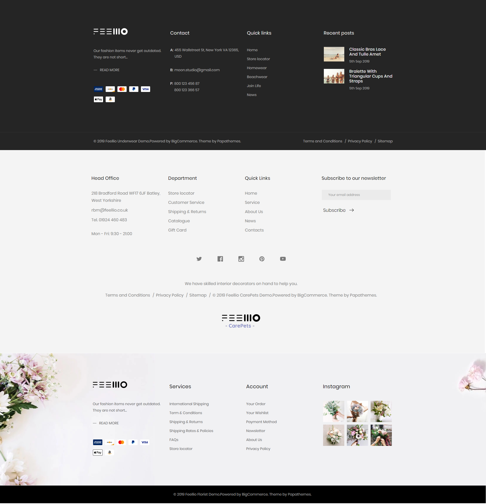

Configure the footer in **Theme Editor** > **Footer** section. 

The theme support some sections in footer:

* Contact
* Information
* Head office
* Custom link 1
* Custom link 2
* List brand
* List webpage
* List category
* Recent post
* Instagram
* newslleter
* Copyright
* List payment menthos
* Follow us
* Logo

You can chooes the section to display in the hook.

* The first column
* The first column
* The third column
* The fourth column
* The footer bottom

You can change colors, font, font size, style... of the footer.

You can select the sections displayed on the footer (maximum 11 sections) in **Theme Editor** > **Footer** > **The hook name**.

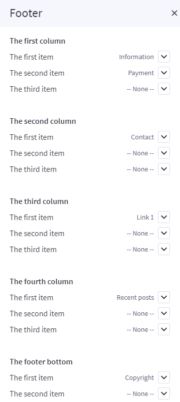

### List of available sections key: ###

* **contact**
* **information**
* **link-1**
* **link-2**
* **link-brands**
* **link-categories**
* **link-webpages**
* **recent-posts**
* **instagram**
* **newsletter**
* **copyright**
* **payment**
* **head-office**
* **follow-us**
* **follow-us-bottom**
* **logo**

## Footer Section

## --- Contact

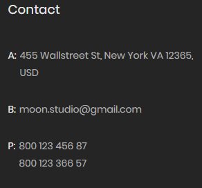

You can configure Footer Contact Section in **Theme Editor** > **Footer** > **Footer contact(section)**.

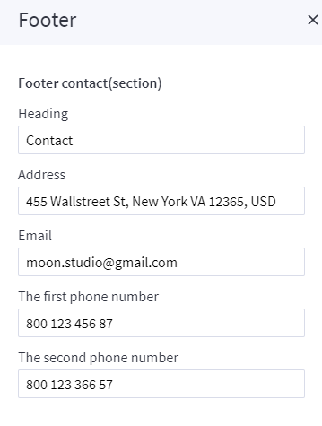

## --- Information

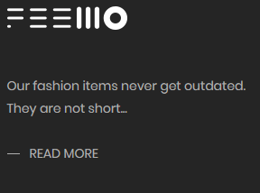

You can configure Footer Information Section in **Theme Editor** > **Footer** > **Footer infomation(section)**.

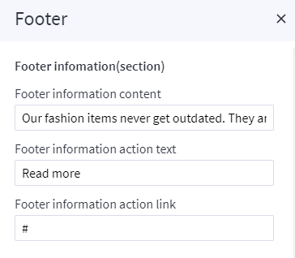

## --- Head office

You can configure Footer Head office Section in **Theme Editor** > **Footer** > **Footer head office(section)**.

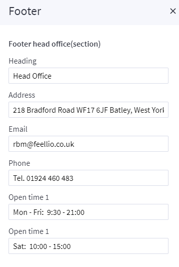

## --- Custom link 1

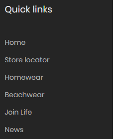

You can configure Footer Custom link 1 Section in **Theme Editor** > **Footer** > **Footer link 1**.

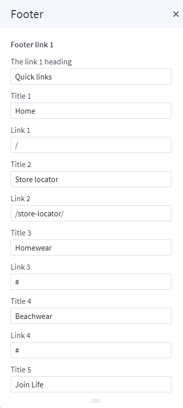

## --- Custom link 2

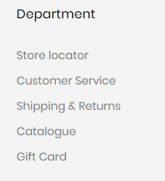

You can configure Footer Custom link 2 Section in **Theme Editor** > **Footer** > **Footer link 2**.

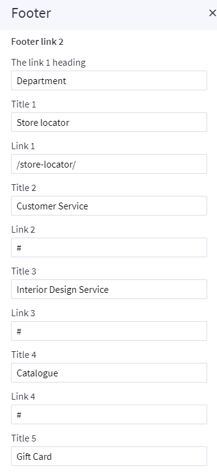

## --- The footer bottom link

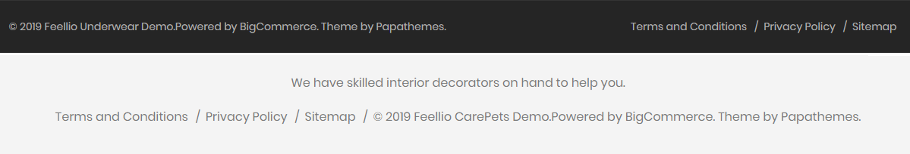

You can configure The footer bottom link Section in **Theme Editor** > **Footer** > **The footer bottom link**.

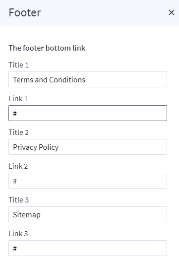

## --- List brand

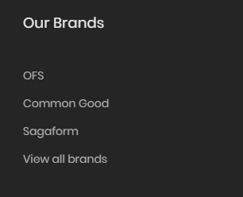

You can configure Footer Brands Section in **Theme Editor** > **Footer** > **Brands**.

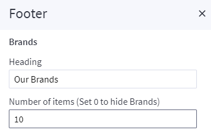

## --- List webpage

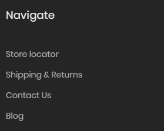

You can configure Footer Webpage Section in **Theme Editor** > **Footer** > **Webpages**.

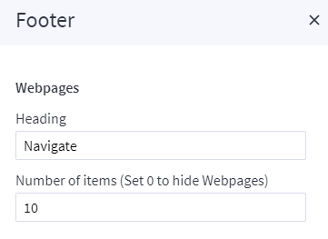

## --- List category

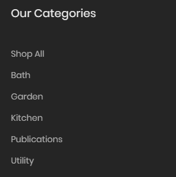

You can configure Footer Categories Section in **Theme Editor** > **Footer** > **Categories**.

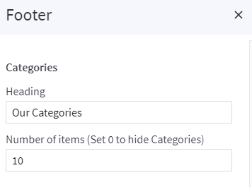

## --- Recent post

You can configure Footer Recent post Section in **Theme Editor** > **Footer** > **Recent posts**.

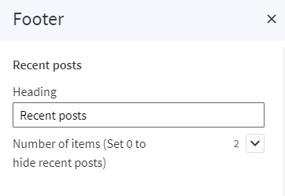

## --- Instagram

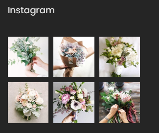

You can configure Footer Instagram Section in **Theme Editor** > **Home Page** > **Instagram**. Here you can configure access token and number of photos.

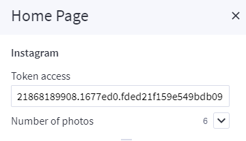

## --- Newslleter

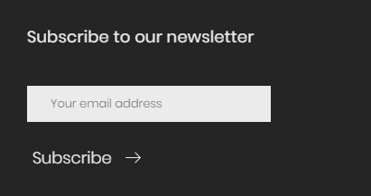

## --- Copyright

You can configure Footer Copyright Section in **Theme Editor** > **Footer** > **Copyright**.

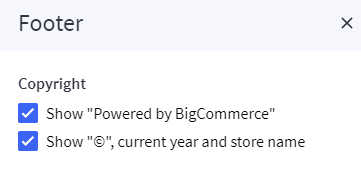

## --- List payment menthos

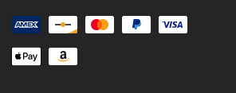

You can configure Footer Payment Section in **Theme Editor** > **Footer** > **Payment icons**.

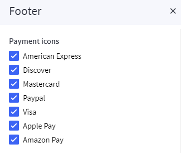

## --- Follow us

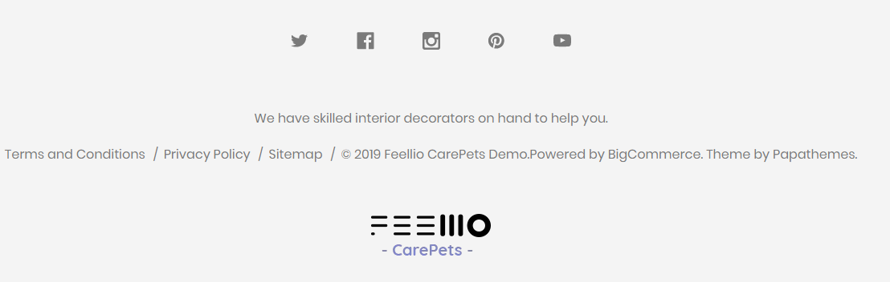

You can configure Footer Follow us Section in **Storefront** > **Social Media Links**.

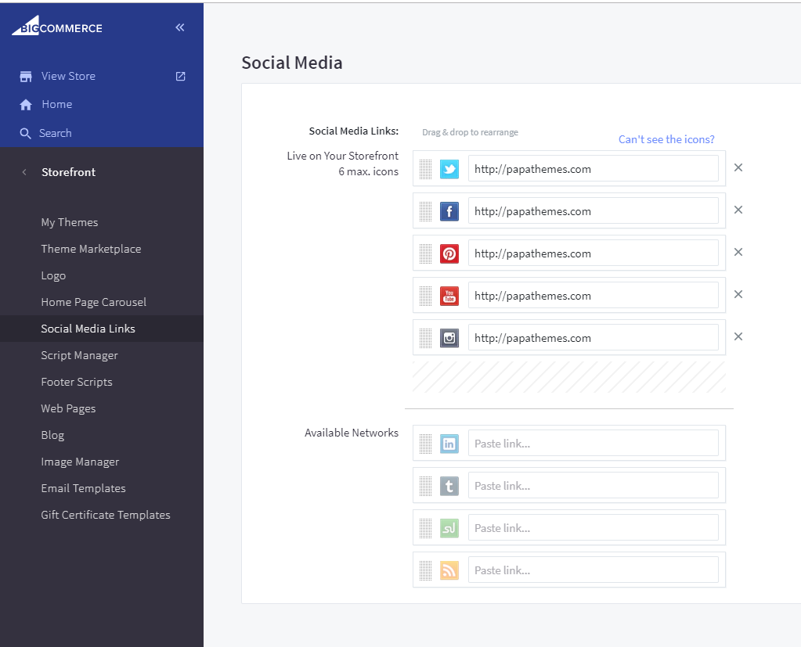

## --- Logo

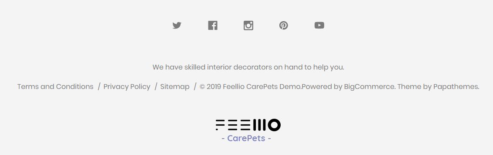

You can configure Footer Logo Section in **Theme Editor** > **Footer** > **Logo**.

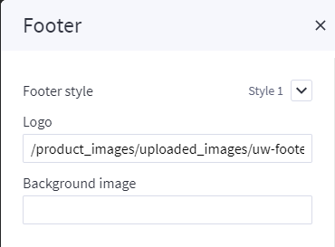
