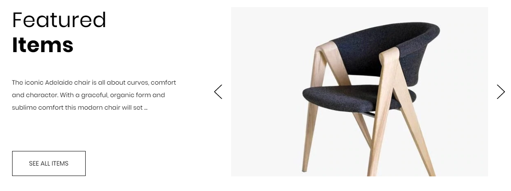
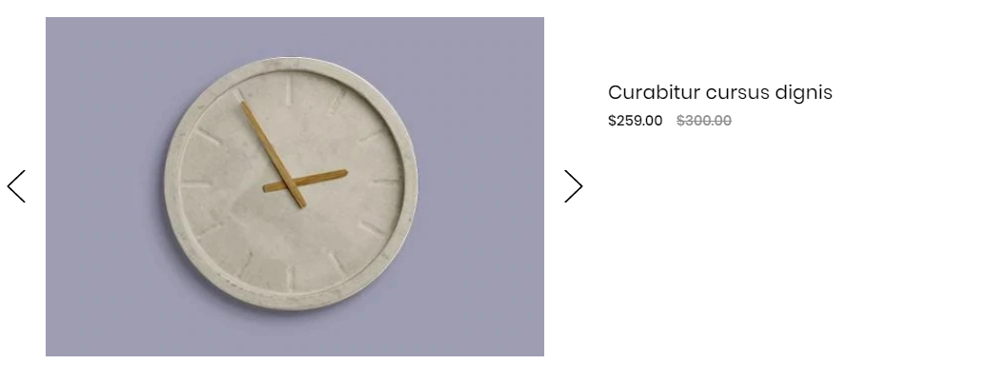
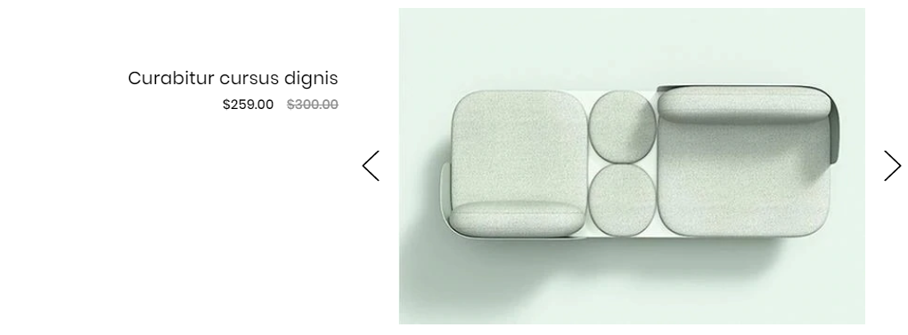
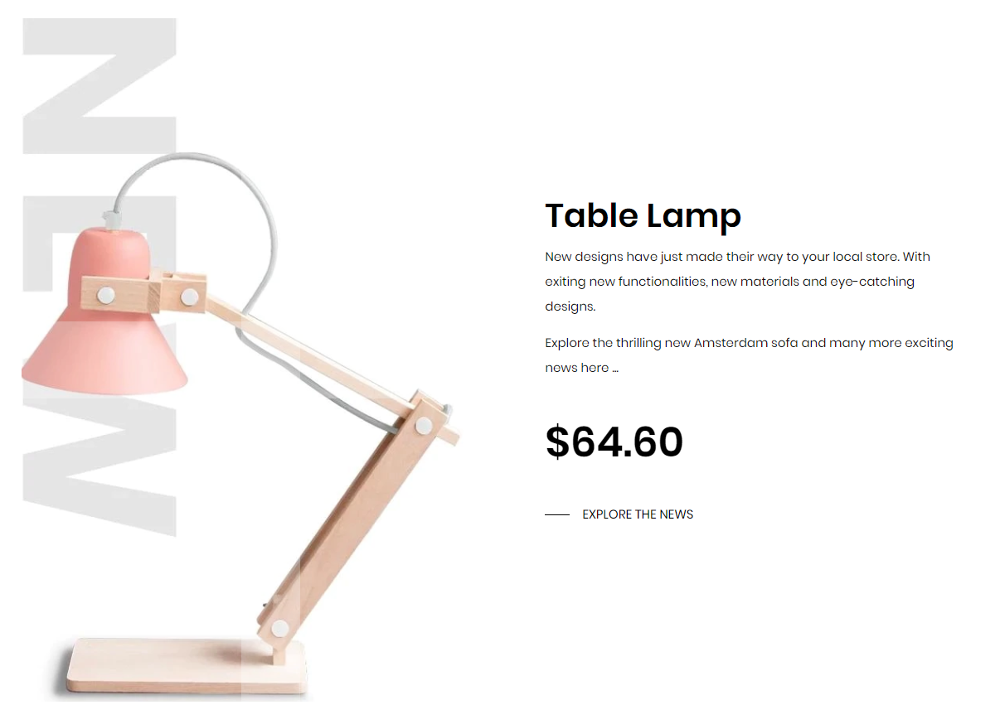
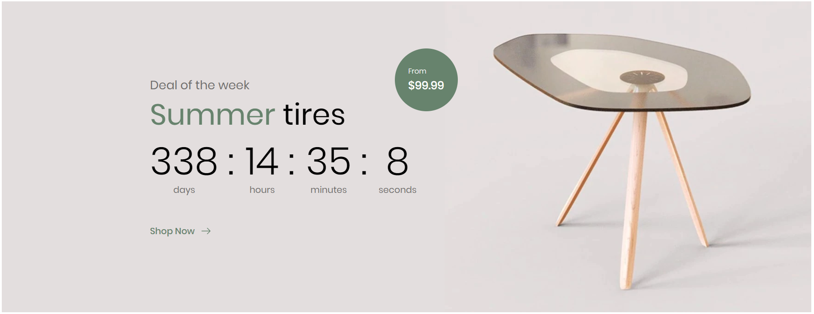
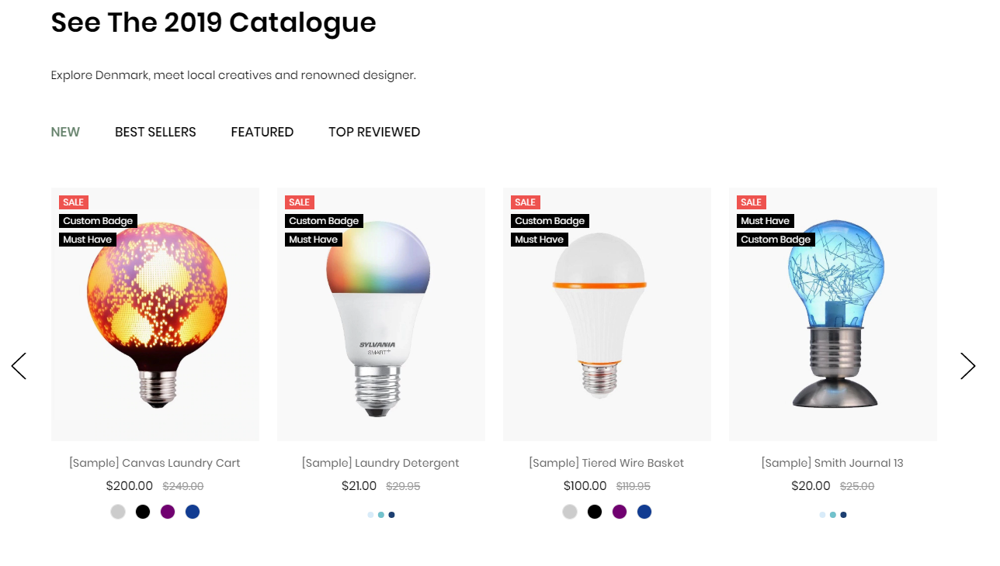
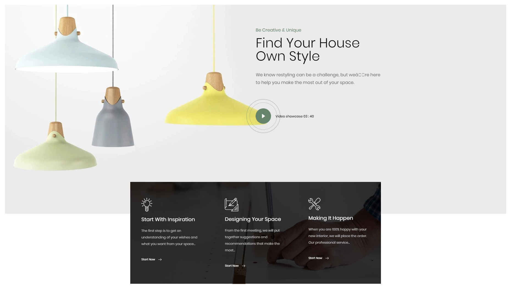
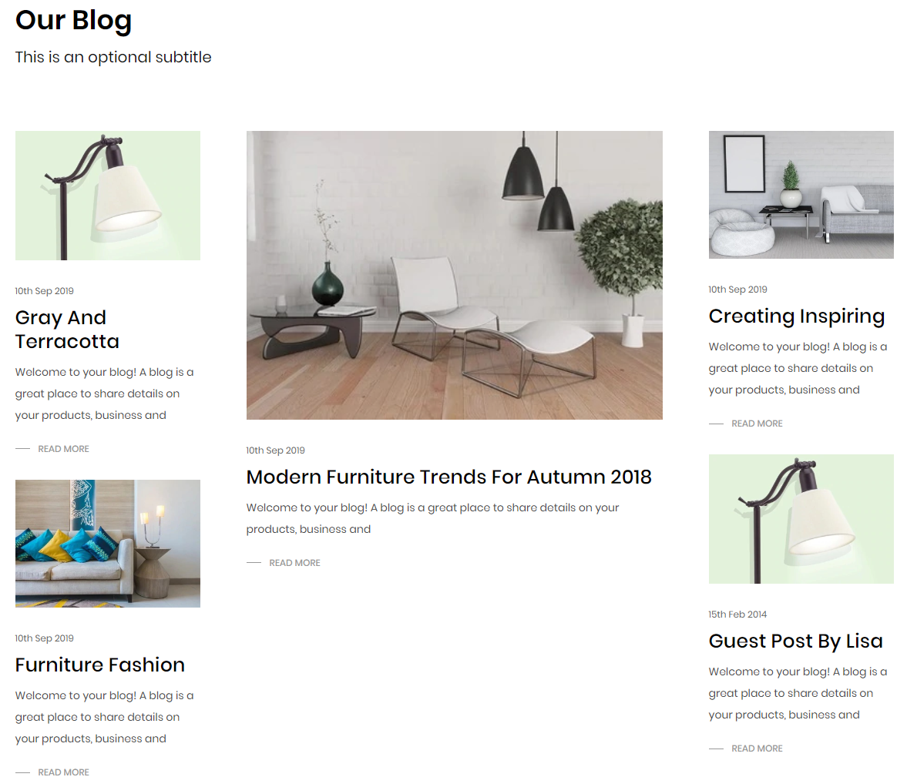

# Furniture Style

## Home Page Section

## --- Sections Manager

You can select the sections displayed on the homepage (maximum 11 sections) in **Theme Editor** > **Homepage** > **Sections**.

--- 

### List of available sections key: ###

* **furniture-featured**
* **furniture-product-1**
* **furniture-product-2**
* **furniture-product-new**
* **furniture-banner-deal**
* **furniture-product-tab**
* **furniture-banner-video**
* **furniture-blogs**

## --- Feellio Furniture Featured Section

To edit content and images of banners, Open the link below on your web browser: [https://bc-feellio-builder.papathemes.com/](https://bc-feellio-builder.papathemes.com/)

Chooes the tab __Feellio Furniture Featured Section__ and Enter all required info on the form.

- Create a new banner in __Marketing__ > __Banners__ > click __Create a Banner__ button.
- Click button __HTML__ in __Banner Content__ editor to show __HTML Source Editor__.
- Copy and paste the code above to __HTML Source Editor__. Then click __Update__ button:

Set Show on __Page = Home Page__ and __Location = Top of Page__:

## --- Feellio Furniture Products 1 Section

Chooes the tab __Feellio Furniture Products 1 Section__ and Enter all required info on the form.

- Create a new banner in __Marketing__ > __Banners__ > click __Create a Banner__ button.
- Click button __HTML__ in __Banner Content__ editor to show __HTML Source Editor__.
- Copy and paste the code above to __HTML Source Editor__. Then click __Update__ button:

Set Show on __Page = Home Page__ and __Location = Top of Page__:

## --- Feellio Furniture Products 2 Section

Chooes the tab __Feellio Furniture Products 2 Section__ and Enter all required info on the form.

- Create a new banner in __Marketing__ > __Banners__ > click __Create a Banner__ button.
- Click button __HTML__ in __Banner Content__ editor to show __HTML Source Editor__.
- Copy and paste the code above to __HTML Source Editor__. Then click __Update__ button:

Set Show on __Page = Home Page__ and __Location = Top of Page__:

## --- Feellio Furniture Product New Section

To edit content and images of banners, Open the link below on your web browser: [https://bc-feellio-builder.papathemes.com/](https://bc-feellio-builder.papathemes.com/)

Chooes the tab __Feellio Furniture Product New Section__ and Enter all required info on the form.

- Create a new banner in __Marketing__ > __Banners__ > click __Create a Banner__ button.
- Click button __HTML__ in __Banner Content__ editor to show __HTML Source Editor__.
- Copy and paste the code above to __HTML Source Editor__. Then click __Update__ button:

Set Show on __Page = Home Page__ and __Location = Top of Page__:

## --- Feellio Furniture Banner Deal Section

To edit content and images of banners, Open the link below on your web browser: [https://bc-feellio-builder.papathemes.com/](https://bc-feellio-builder.papathemes.com/)

Chooes the tab __Feellio Furniture Banner Deal Section__ and Enter all required info on the form.

- Create a new banner in __Marketing__ > __Banners__ > click __Create a Banner__ button.
- Click button __HTML__ in __Banner Content__ editor to show __HTML Source Editor__.
- Copy and paste the code above to __HTML Source Editor__. Then click __Update__ button:

Set Show on __Page = Home Page__ and __Location = Top of Page__:

## --- Feellio Furniture Products Tab Section

Furniture Products Tab displays on the Home page can be chooes section **Furniture Products Tab** in **Home page** > **Section**.

You can configure Products tab 1 settings in **Theme Editor** > **Home Page Section** > **Products tab 1**.

A few configs only working at the section that this section on section demo has these configs.

## --- Feellio Furniture Banner Video Section

To edit content and images of banners, Open the link below on your web browser: [https://bc-feellio-builder.papathemes.com/](https://bc-feellio-builder.papathemes.com/)

Chooes the tab __Feellio Furniture Banner Video Section__ and Enter all required info on the form.

- Create a new banner in __Marketing__ > __Banners__ > click __Create a Banner__ button.
- Click button __HTML__ in __Banner Content__ editor to show __HTML Source Editor__.
- Copy and paste the code above to __HTML Source Editor__. Then click __Update__ button:

Set Show on __Page = Home Page__ and __Location = Top of Page__:

## --- Feellio Furniture Blog Section

Furniture Blog Section displays on the Home page can be chooes section **Furniture Blog** in **Home page** > **Section**.

You can configure Furniture Blog settings in **Theme Editor** > **Home Page Section** > **Blog**.

A few configs only working at the section that this section on section demo has these configs.

