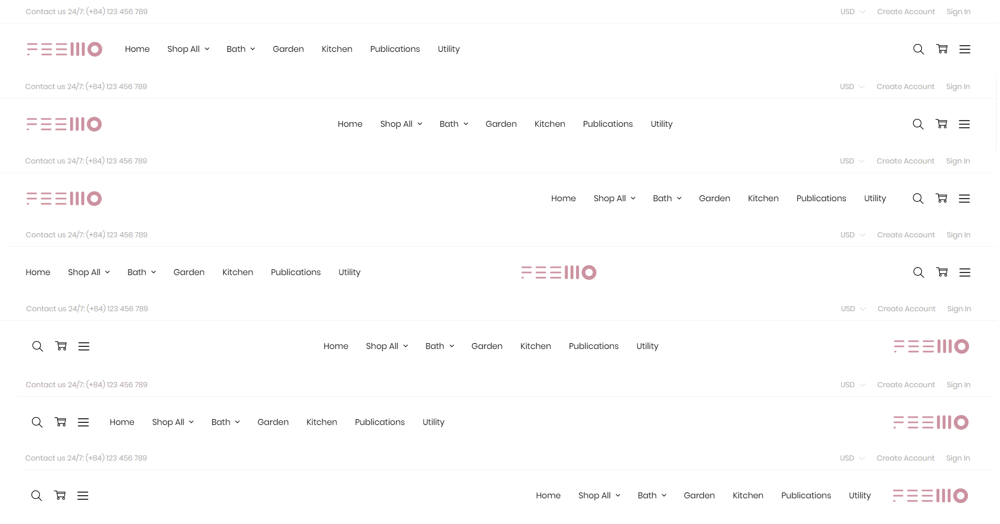
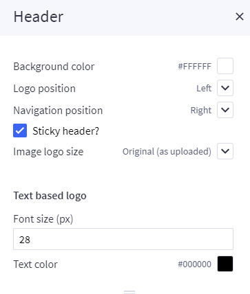
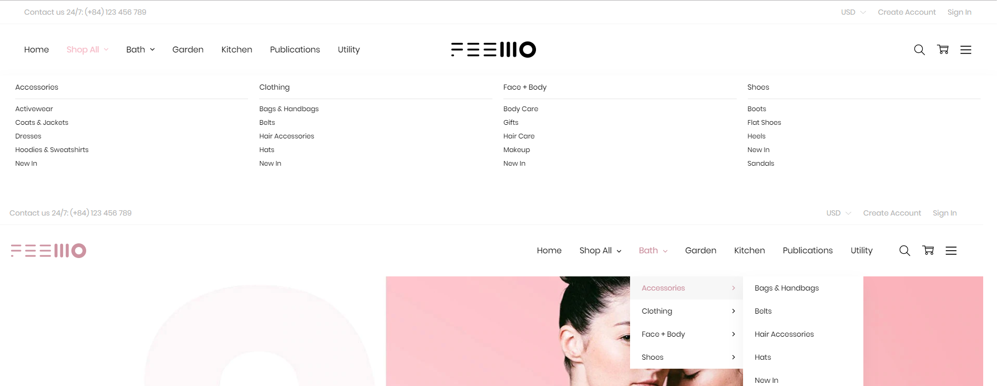

# Header customization

## --- Logo

Theme supports header with logo position **left**, **right** or **center**. It is configured in **Theme Editor** > **Header** > **Logo position** 

You can configure Header style, logo size, colors, fonts in **Theme Editor** > **Header**.

;

## --- Mega Menu vs. Standard Menu

Theme supports both Mega Menu and Standard Menu. You can configure in **Theme Editor** > **Header** > **Main Navigation** > **Navigation design**.

The menu is automatically popuplated from your product categories and web pages (in **Storefront** > **Web Pages**). You can hide all web pages on this menu by tick on the option **Hide web pages in main navigation** in **Theme Editor** > **Header**.

Theme supports menu position **left**, **right**, or **center**. It is configured in **Theme Editor** > **Header** > ****Navigation position**.

;

## --- Top Banner

You can edit the top banner on the homepage, category pages, product pages in **Marketing** > **Banner Manager**.