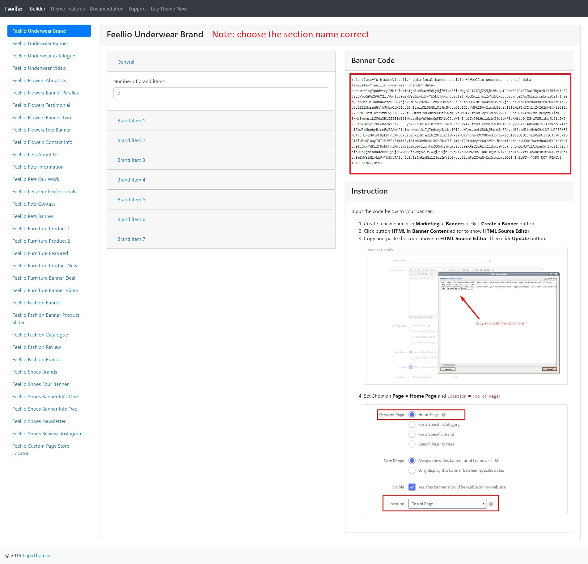

# Pets Style

## Home Page Section

## --- Sections Manager

You can select the sections displayed on the homepage (maximum 11 sections) in **Theme Editor** > **Homepage** > **Sections**.

--- 

### List of available sections key: ###

* **pets-about-us**
* **pets-information**
* **pets-our-work**
* **pets-products-1**
* **pets-products-2**
* **pets-our-professionals**
* **pets-contact**
* **pets-banner**
* **pets-blogs**
* **pets-brands**
* **pets-instagram**

## --- Feellio Pets About Us Section

To edit content and images of banners, Open the link below on your web browser: [https://bc-feellio-builder.papathemes.com/](https://bc-feellio-builder.papathemes.com/)

Chooes the tab __Feellio Pets About Us Section__ and Enter all required info on the form.

- Create a new banner in __Marketing__ > __Banners__ > click __Create a Banner__ button.
- Click button __HTML__ in __Banner Content__ editor to show __HTML Source Editor__.
- Copy and paste the code above to __HTML Source Editor__. Then click __Update__ button:

Set Show on __Page = Home Page__ and __Location = Top of Page__:

## --- Feellio Pets Information Section

To edit content and images of banners, Open the link below on your web browser: [https://bc-feellio-builder.papathemes.com/](https://bc-feellio-builder.papathemes.com/)

Chooes the tab __Feellio Pets Information Section__ and Enter all required info on the form.

- Create a new banner in __Marketing__ > __Banners__ > click __Create a Banner__ button.
- Click button __HTML__ in __Banner Content__ editor to show __HTML Source Editor__.
- Copy and paste the code above to __HTML Source Editor__. Then click __Update__ button:

Set Show on __Page = Home Page__ and __Location = Top of Page__:

## --- Feellio Pets Our Work Section

To edit content and images of banners, Open the link below on your web browser: [https://bc-feellio-builder.papathemes.com/](https://bc-feellio-builder.papathemes.com/)

Chooes the tab __Feellio Pets Our Work Section__ and Enter all required info on the form.

- Create a new banner in __Marketing__ > __Banners__ > click __Create a Banner__ button.
- Click button __HTML__ in __Banner Content__ editor to show __HTML Source Editor__.
- Copy and paste the code above to __HTML Source Editor__. Then click __Update__ button:

Set Show on __Page = Home Page__ and __Location = Top of Page__:

## --- Feellio Pets Products 1 Section

Pets Products 1 displays on the Home page can be chooes section **Pets Products 1** in **Home page** > **Section**.

You can configure Pets Products 1 settings in **Theme Editor** > **Home Page Section** > **Products 1**.

**Product 1 sort by** you have 3 selection: **New products**, **Feature products**, **Top seller products**

Chooes the selection and setting in **Theme Editor** > **Home Page** > **New products**, **Feature products** or **Top seller products**.

A few configs only working at the section that this section on section demo has these configs.

## --- Feellio Pets Products 2 Section

Pets Products 2 displays on the Home page can be chooes section **Pets Products 2* in **Home page** > **Section**.

You can configure Pets Products 2 settings in **Theme Editor** > **Home Page Section** > **Products 2**.

**Product 2 sort by** you have 3 selection: **New products**, **Feature products**, **Top seller products**

Chooes the selection and setting in **Theme Editor** > **Home Page** > **New products**, **Feature products** or **Top seller products**.

A few configs only working at the section that this section on section demo has these configs.

## --- Feellio Pets Our Professionals Section

To edit content and images of banners, Open the link below on your web browser: [https://bc-feellio-builder.papathemes.com/](https://bc-feellio-builder.papathemes.com/)

Chooes the tab __Feellio Pets Our Professionals Section__ and Enter all required info on the form.

- Create a new banner in __Marketing__ > __Banners__ > click __Create a Banner__ button.
- Click button __HTML__ in __Banner Content__ editor to show __HTML Source Editor__.
- Copy and paste the code above to __HTML Source Editor__. Then click __Update__ button:

Set Show on __Page = Home Page__ and __Location = Top of Page__:

## --- Feellio Pets Contact Section

To edit content and images of banners, Open the link below on your web browser: [https://bc-feellio-builder.papathemes.com/](https://bc-feellio-builder.papathemes.com/)

Chooes the tab __Feellio Pets Contact Section__ and Enter all required info on the form.

- Create a new banner in __Marketing__ > __Banners__ > click __Create a Banner__ button.
- Click button __HTML__ in __Banner Content__ editor to show __HTML Source Editor__.
- Copy and paste the code above to __HTML Source Editor__. Then click __Update__ button:

Set Show on __Page = Home Page__ and __Location = Top of Page__:

## --- Feellio Pets Banner Section

To edit content and images of banners, Open the link below on your web browser: [https://bc-feellio-builder.papathemes.com/](https://bc-feellio-builder.papathemes.com/)

Chooes the tab __Feellio Pets Banner Section__ and Enter all required info on the form.

- Create a new banner in __Marketing__ > __Banners__ > click __Create a Banner__ button.
- Click button __HTML__ in __Banner Content__ editor to show __HTML Source Editor__.
- Copy and paste the code above to __HTML Source Editor__. Then click __Update__ button:

Set Show on __Page = Home Page__ and __Location = Top of Page__:

## --- Feellio Pets Blog Section

Pets Blog Section displays on the Home page can be chooes section **Pets Blog** in **Home page** > **Section**.

You can configure Pets Blog settings in **Theme Editor** > **Home Page Section** > **Blog**.

A few configs only working at the section that this section on section demo has these configs.

## --- Feellio Pets Brands Section

To edit content and images of banners, Open the link below on your web browser: [https://bc-feellio-builder.papathemes.com/](https://bc-feellio-builder.papathemes.com/)

Chooes the tab __Feellio Pets Brands Section__ and Enter all required info on the form.

- Create a new banner in __Marketing__ > __Banners__ > click __Create a Banner__ button.
- Click button __HTML__ in __Banner Content__ editor to show __HTML Source Editor__.
- Copy and paste the code above to __HTML Source Editor__. Then click __Update__ button:

Set Show on __Page = Home Page__ and __Location = Top of Page__:

## --- Feellio Pets Instagram Section

Pets Instagram displays on the Home page can be chooes section **Pets Instagram** in **Home page** > **Section**.

You can configure Pets Instagram in **Theme Editor** > **Home Page** > **Instagram**. Here you can configure access token and number of photos.

