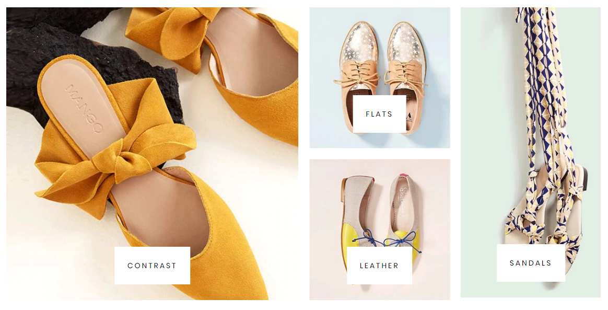
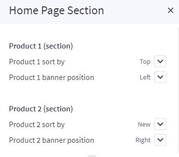
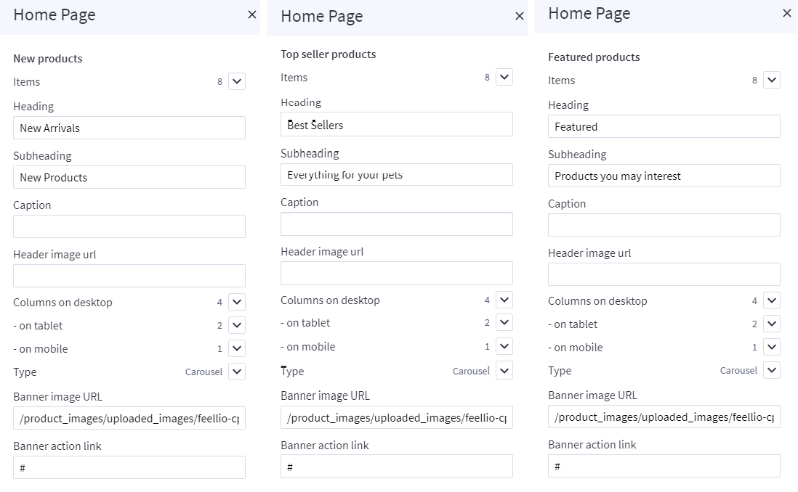
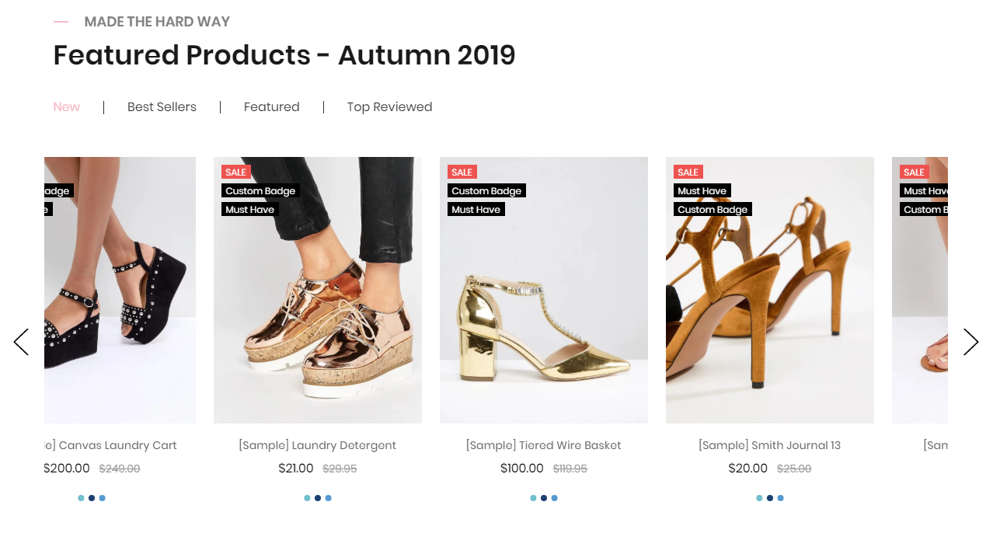
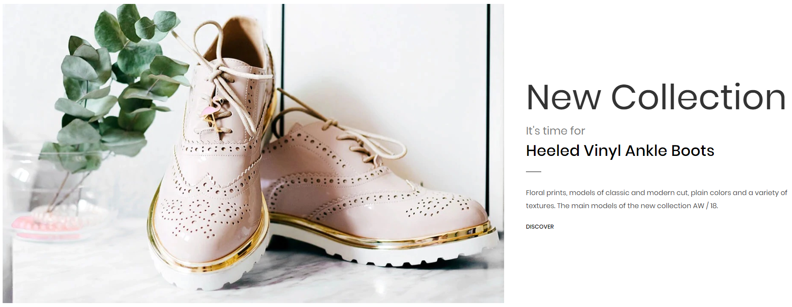
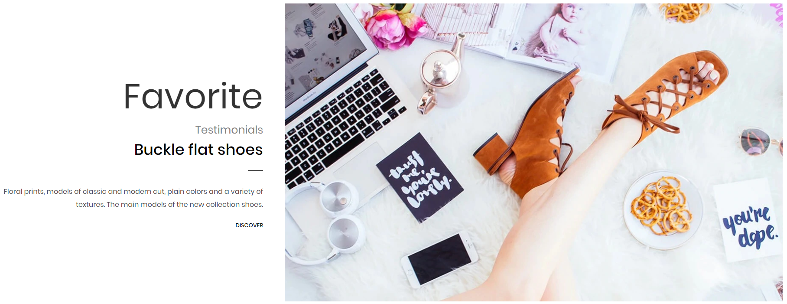
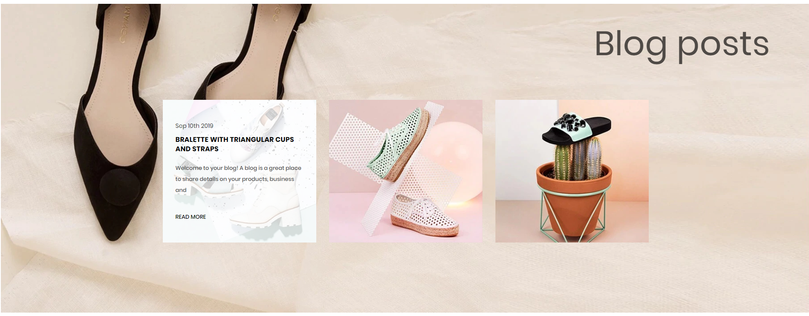
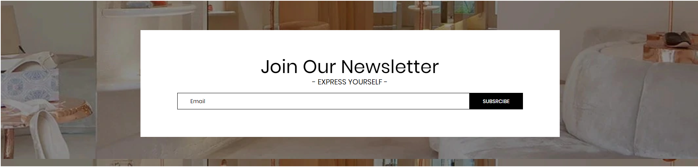
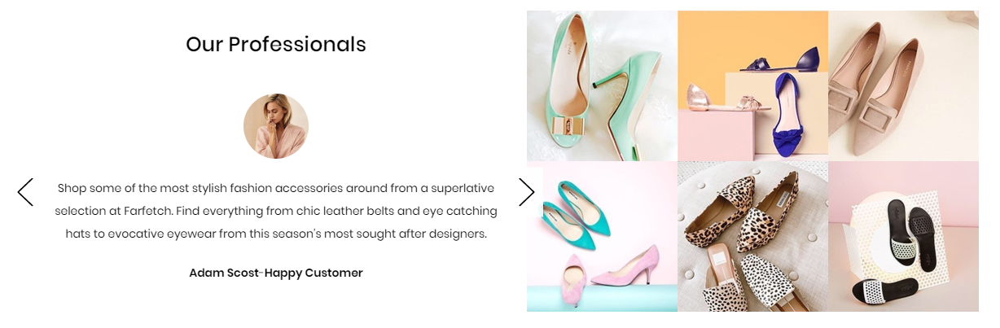
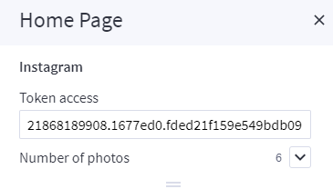

# Shoes Style

## Home Page Section

## --- Sections Manager

You can select the sections displayed on the homepage (maximum 11 sections) in **Theme Editor** > **Homepage** > **Sections**.

--- 

### List of available sections key: ###

* **shoes-brands**
* **shoes-banner**
* **shoes-product**
* **shoes-banner-info-1**
* **shoes-product-tab**
* **shoes-banner-info-2**
* **shoes-blogs**
* **shoes-newsletter**
* **shoes-reviews-instagrams**

## --- Feellio Shoes Brands Section

To edit content and images of banners, Open the link below on your web browser: [https://bc-feellio-builder.papathemes.com/](https://bc-feellio-builder.papathemes.com/)

Chooes the tab __Feellio Shoes Brands Section__ and Enter all required info on the form.

- Create a new banner in __Marketing__ > __Banners__ > click __Create a Banner__ button.
- Click button __HTML__ in __Banner Content__ editor to show __HTML Source Editor__.
- Copy and paste the code above to __HTML Source Editor__. Then click __Update__ button:

Set Show on __Page = Home Page__ and __Location = Top of Page__:

## --- Feellio Shoes Four Banner Section

To edit content and images of banners, Open the link below on your web browser: [https://bc-feellio-builder.papathemes.com/](https://bc-feellio-builder.papathemes.com/)

Chooes the tab __Feellio Shoes Four Banner Section__ and Enter all required info on the form.

- Create a new banner in __Marketing__ > __Banners__ > click __Create a Banner__ button.
- Click button __HTML__ in __Banner Content__ editor to show __HTML Source Editor__.
- Copy and paste the code above to __HTML Source Editor__. Then click __Update__ button:

Set Show on __Page = Home Page__ and __Location = Top of Page__:

## --- Feellio Shoes Products Section

Shoes Products displays on the Home page can be chooes section **Shoes Products** in **Home page** > **Section**.

You can configure Shoes Products settings in **Theme Editor** > **Home Page Section** > **Products 1**.

**Product 1 sort by** you have 3 selection: **New products**, **Feature products**, **Top seller products**

Chooes the selection and setting in **Theme Editor** > **Home Page** > **New products**, **Feature products** or **Top seller products**.

A few configs only working at the section that this section on section demo has these configs.

## --- Feellio Shoes Products tab Section

Shoes Products tab displays on the Home page can be chooes section **Shoes Products tab** in **Home page** > **Section**.

You can configure Products tab 1 settings in **Theme Editor** > **Home Page Section** > **Products tab 1**.

A few configs only working at the section that this section on section demo has these configs.

## --- Feellio Shoes Banner Info 1 Section

To edit content and images of banners, Open the link below on your web browser: [https://bc-feellio-builder.papathemes.com/](https://bc-feellio-builder.papathemes.com/)

Chooes the tab __Feellio Shoes Banner Info 1 Section__ and Enter all required info on the form.

- Create a new banner in __Marketing__ > __Banners__ > click __Create a Banner__ button.
- Click button __HTML__ in __Banner Content__ editor to show __HTML Source Editor__.
- Copy and paste the code above to __HTML Source Editor__. Then click __Update__ button:

Set Show on __Page = Home Page__ and __Location = Top of Page__:

## --- Feellio Shoes Banner Info 2 Section

To edit content and images of banners, Open the link below on your web browser: [https://bc-feellio-builder.papathemes.com/](https://bc-feellio-builder.papathemes.com/)

Chooes the tab __Feellio Shoes Banner Info 2 Section__ and Enter all required info on the form.

- Create a new banner in __Marketing__ > __Banners__ > click __Create a Banner__ button.
- Click button __HTML__ in __Banner Content__ editor to show __HTML Source Editor__.
- Copy and paste the code above to __HTML Source Editor__. Then click __Update__ button:

Set Show on __Page = Home Page__ and __Location = Top of Page__:

## --- Feellio Shoes Blog Section

Shoes Blog Section displays on the Home page can be chooes section **Shoes Blog** in **Home page** > **Section**.

You can configure Shoes Blog settings in **Theme Editor** > **Home Page Section** > **Blog**.

A few configs only working at the section that this section on section demo has these configs.

## --- Feellio Shoes Newsletter Section

To edit content and images of banners, Open the link below on your web browser: [https://bc-feellio-builder.papathemes.com/](https://bc-feellio-builder.papathemes.com/)

Chooes the tab __Feellio Shoes Newsletter Section__ and Enter all required info on the form.

- Create a new banner in __Marketing__ > __Banners__ > click __Create a Banner__ button.
- Click button __HTML__ in __Banner Content__ editor to show __HTML Source Editor__.
- Copy and paste the code above to __HTML Source Editor__. Then click __Update__ button:

Set Show on __Page = Home Page__ and __Location = Top of Page__:

## --- Feellio Shoes Reviews Instagrams Section

To edit content and images of banners, Open the link below on your web browser: [https://bc-feellio-builder.papathemes.com/](https://bc-feellio-builder.papathemes.com/)

Chooes the tab __Feellio Shoes Reviews Instagrams Section__ and Enter all required info on the form.

- Create a new banner in __Marketing__ > __Banners__ > click __Create a Banner__ button.
- Click button __HTML__ in __Banner Content__ editor to show __HTML Source Editor__.
- Copy and paste the code above to __HTML Source Editor__. Then click __Update__ button:

Set Show on __Page = Home Page__ and __Location = Top of Page__:

You can configure Pets Instagram in **Theme Editor** > **Home Page** > **Instagram**. Here you can configure access token and number of photos.

