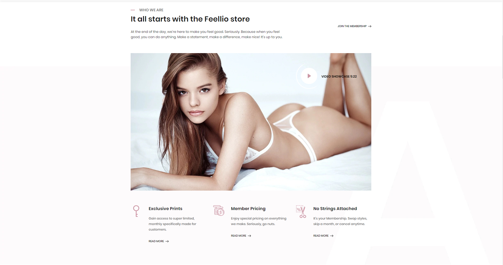
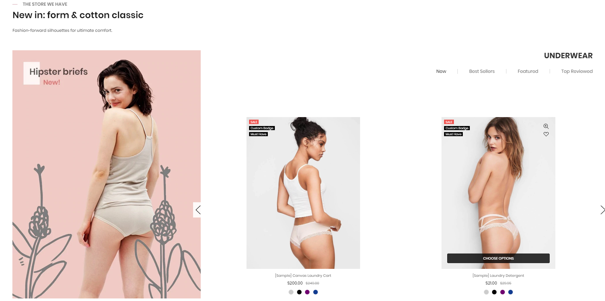
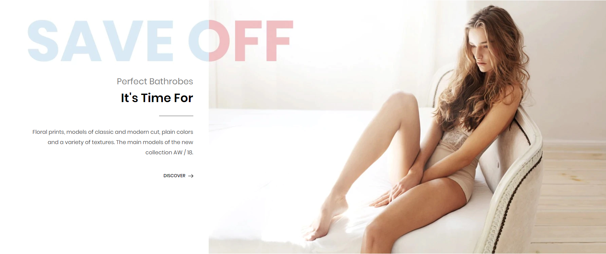
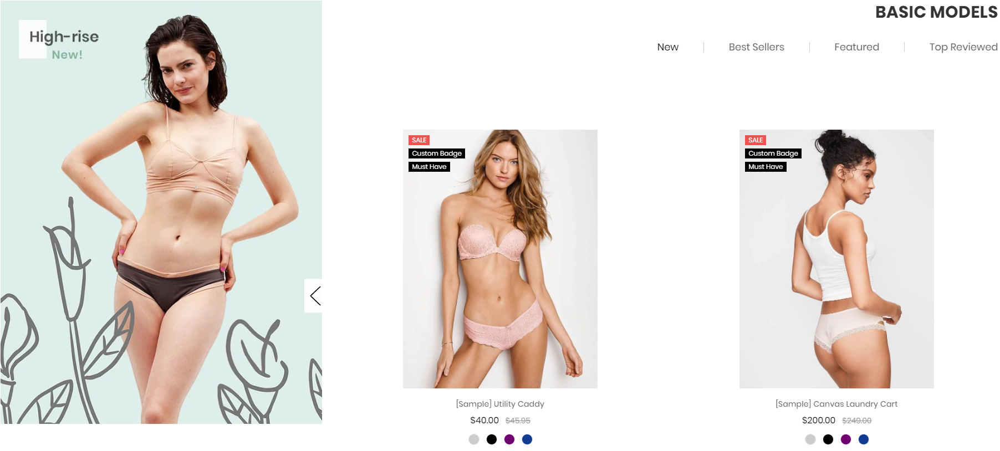
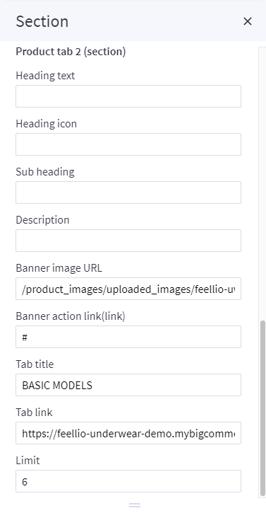
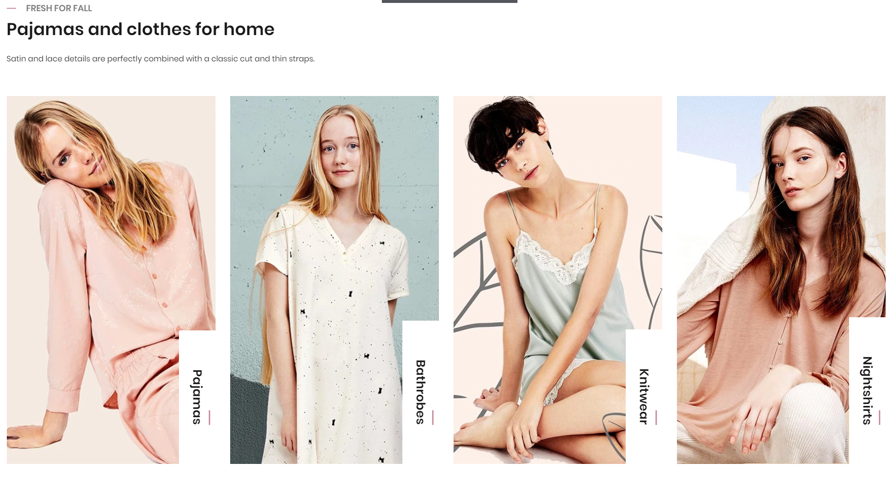
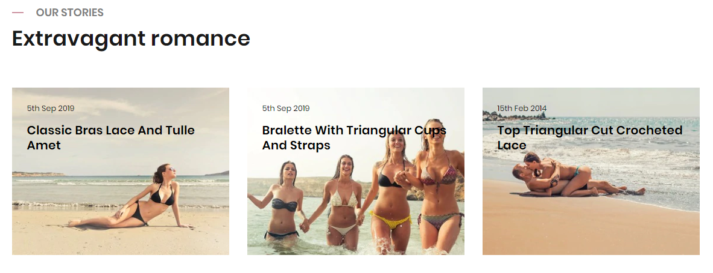
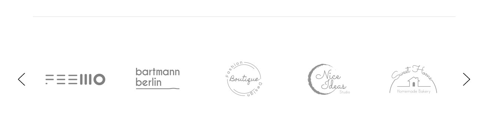

# Underwear Style

## Home Page Section

## --- Sections Manager

You can select the sections displayed on the homepage (maximum 11 sections) in **Theme Editor** > **Homepage** > **Sections**.

--- 

### List of available sections key: ###

* **section1": "underwear-video**
* **section2": "underwear-product-tab-1**
* **section3": "underwear-banner**
* **section4": "underwear-product-tab-2**
* **section5": "underwear-catalogue**
* **section6": "underwear-blogs**
* **section7": "underwear-brands**

## --- Feellio Underwear Video Section

To edit content and images of banners, Open the link below on your web browser: [https://bc-feellio-builder.papathemes.com/](https://bc-feellio-builder.papathemes.com/)

Chooes the tab __Feellio Underwear Video Section__ and Enter all required info on the form.

- Create a new banner in __Marketing__ > __Banners__ > click __Create a Banner__ button.
- Click button __HTML__ in __Banner Content__ editor to show __HTML Source Editor__.
- Copy and paste the code above to __HTML Source Editor__. Then click __Update__ button:

Set Show on __Page = Home Page__ and __Location = Top of Page__:

## --- Feellio Underwear Products tab 1 Section

Products tab 1 displays on the Home page can be chooes section **Underwear Products tab 2** in **Home page** > **Section**.

You can configure Products tab 1 settings in **Theme Editor** > **Home Page Section** > **Products tab 1**.

A few configs only working at the section that this section on section demo has these configs.

## --- Feellio Underwear Banner Section

To edit content and images of banners, Open the link below on your web browser: [https://bc-feellio-builder.papathemes.com/](https://bc-feellio-builder.papathemes.com/)

Chooes the tab __Feellio Underwear Video Section__ and Enter all required info on the form.

- Create a new banner in __Marketing__ > __Banners__ > click __Create a Banner__ button.
- Click button __HTML__ in __Banner Content__ editor to show __HTML Source Editor__.
- Copy and paste the code above to __HTML Source Editor__. Then click __Update__ button:

Set Show on __Page = Home Page__ and __Location = Top of Page__:

## --- Feellio Underwear Products tab 2 Section

Products tab 2 displays on the Home page can be chooes section **Underwear Products tab 2** in **Home page** > **Section**.

You can configure Products tab 2 settings in **Theme Editor** > **Home Page Section** > **Products tab 2**.

A few configs only working at the section that this section on section demo has these configs.

## --- Feellio Underwear Catalogue Section

To edit content and images of banners, Open the link below on your web browser: [https://bc-feellio-builder.papathemes.com/](https://bc-feellio-builder.papathemes.com/)

Chooes the tab __Feellio Underwear Catalogue Section__ and Enter all required info on the form.

- Create a new banner in __Marketing__ > __Banners__ > click __Create a Banner__ button.
- Click button __HTML__ in __Banner Content__ editor to show __HTML Source Editor__.
- Copy and paste the code above to __HTML Source Editor__. Then click __Update__ button:

Set Show on __Page = Home Page__ and __Location = Top of Page__:

## --- Feellio Underwear Blog Section

Underwear Blog Section displays on the Home page can be chooes section **Underwear Blog** in **Home page** > **Section**.

You can configure Underwear Blog settings in **Theme Editor** > **Home Page Section** > **Blog**.

A few configs only working at the section that this section on section demo has these configs.

## --- Feellio Underwear Brands Section

To edit content and images of banners, Open the link below on your web browser: [https://bc-feellio-builder.papathemes.com/](https://bc-feellio-builder.papathemes.com/)

Chooes the tab __Feellio Underwear Brands Section__ and Enter all required info on the form.

- Create a new banner in __Marketing__ > __Banners__ > click __Create a Banner__ button.
- Click button __HTML__ in __Banner Content__ editor to show __HTML Source Editor__.
- Copy and paste the code above to __HTML Source Editor__. Then click __Update__ button:

Set Show on __Page = Home Page__ and __Location = Top of Page__:

