## Main Carousel

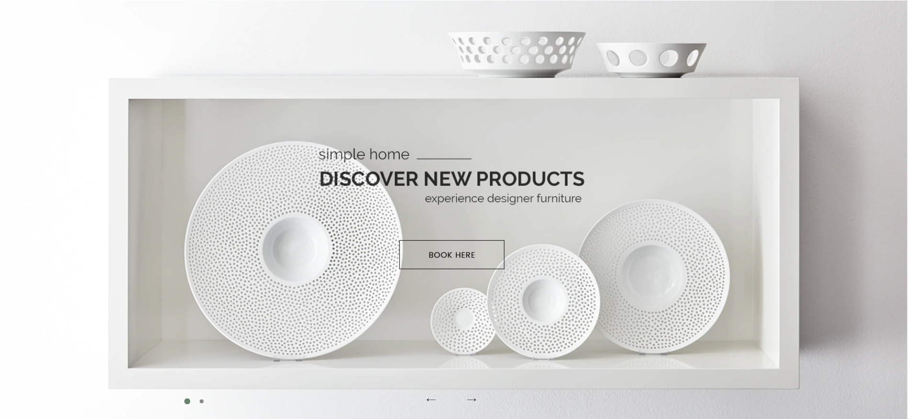

Main carousel displays on the home page can be input in **Storefront** > **Home Page Carousel**.

You can configure carousel settings in **Theme Editor** > **Home Page** > **Carousel** section. Here you can turn on/off this carousel, configure colors, content position and so on.

Our recommended image size is **1920x770px**.

Config style
The theme supports change style text, colors...

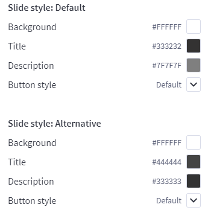

Change position of text content
The theme supports showing slideshow content like heading, text, button on **left**, **right** or **center** of the the image. To configure this option, open Theme Editor, Look into section Carousel, click to expand:

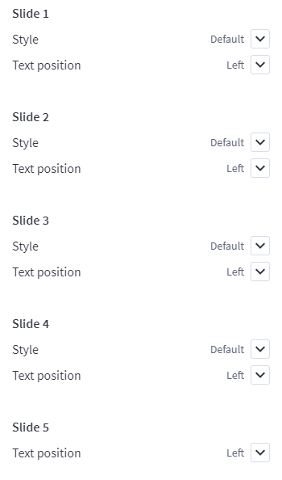

Colors Customization
To customize color of the slideshow's elements, look into section Carousel in the Theme Editor:

Choose position of each slide you want to change.

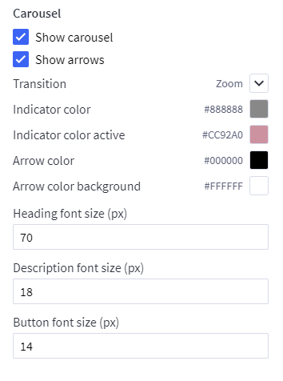

Hide the slideshow
To hide the slideshow on homepage, uncheck on the checkbox Show Carousel in section Carousel of the Theme Editor.


# Custom sidebar

## --- Custom banners on the sidebar

Theme support custom banners display on the sidebar for category pages and brand pages.

To enable these banners, open **Theme Editor** > **Sidebar**, tick on these options:

* **Show banner #1 on category pages**
* **Show banner #2 on category pages**
* **Show banner #1 on brand pages**
* **Show banner #2 on brand pages**

Create a new banner in **Marketing** > **Banners**:

### Banner 1 on category pages

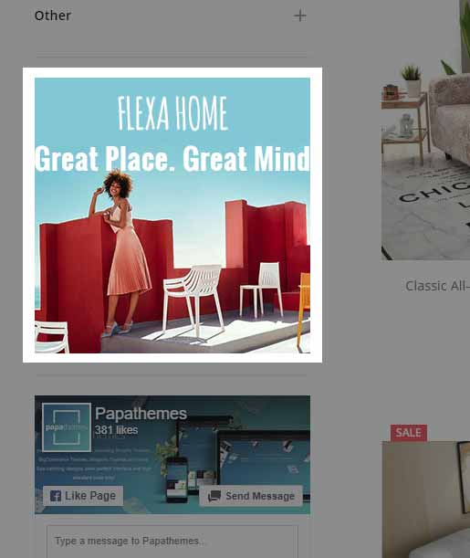

* **Banner Name**: `Sidebar banner on category pages (chiara-sidebar-category-banner1)`
* **Banner Content**: Click on the HTML to edit HTML source.

```html
<p data-remote-banner-position="chiara-sidebar-category-banner1"><a href="#"></a></p>
```

* **Show on Page**: `Search Results Page`
* **Location**: `Top of Page`

Our recommended image size is **302x302px**.


### Banner 2 on category pages

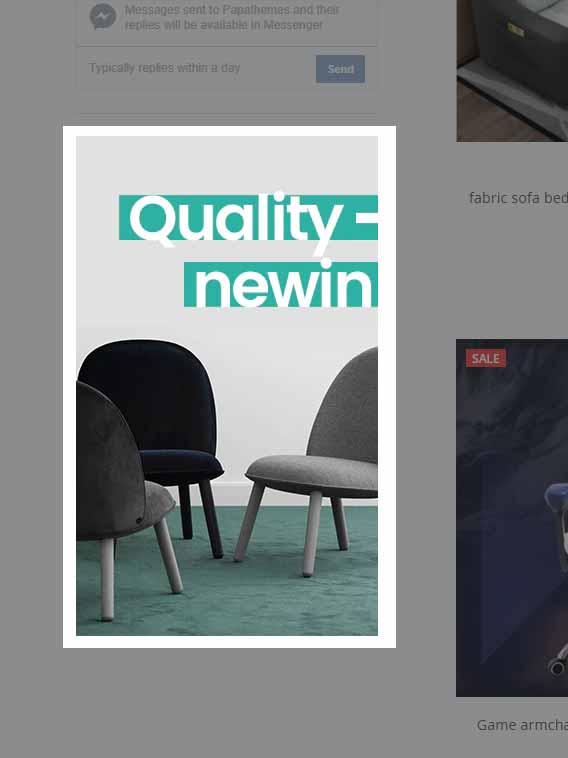

* **Banner Name**: `Sidebar banner on category pages (chiara-sidebar-category-banner2)`
* **Banner Content**: Click on the HTML to edit HTML source.

```html
<p data-remote-banner-position="chiara-sidebar-category-banner2"><a href="#"></a></p>
```

* **Show on Page**: `Search Results Page`
* **Location**: `Top of Page`

Our recommended image size is **302x500px**.


### Banner 1 on brand pages

* **Banner Name**: `Sidebar banner on brand pages (chiara-sidebar-brand-banner1)`
* **Banner Content**: Click on the HTML to edit HTML source.

```html
<p data-remote-banner-position="chiara-sidebar-brand-banner1"><a href="#"></a></p>
```

* **Show on Page**: `Search Results Page`
* **Location**: `Top of Page`


### Banner 2 on brand pages

* **Banner Name**: `Sidebar banner on brand pages (chiara-sidebar-brand-banner2)`
* **Banner Content**: Click on the HTML to edit HTML source.

```html
<p data-remote-banner-position="chiara-sidebar-brand-banner2"><a href="#"></a></p>
```

* **Show on Page**: `Search Results Page`
* **Location**: `Top of Page`


## --- New Products on sidebar


Configure in **Theme Editor** > **Sidebar**:

* **New products**: number of products to display.


## --- Facebook likes & chat box on sidebar

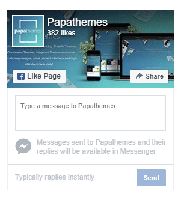

Configure in **Theme Editor** > **Sidebar**, input your facebook page name in **Facebook page** text box. If your facebook page URL is `https://facebook.com/papathemes`, input only `papathemes`. Make sure your Facebook page is public for anyone in order to display on your store.

## Custom content placement

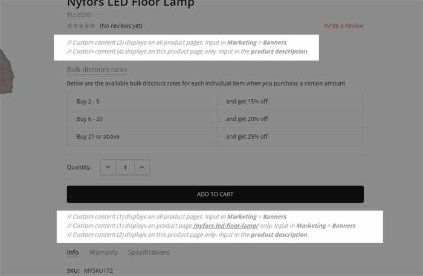

### Display custom content on all product pages under product ratings:

Create a new banner in **Marketing** > **Banners**:

-- **Banner Content** click HTML button to input HTML code:

```html
<div data-remote-banner-position="chiara-productpage-banner1">
  ADD YOUR CUSTOM CONTENT HERE...
</div>
```

- **Show on Page**: `Search Results Page`
- **Location**: `Top of Page`


### Display custom content on a specific product page under product ratings:

Edit a product, in **Description** field, click HTML button to input HTML code:

```html
<div data-local-banner-position="chiara-productpage-banner2">
  ADD YOUR CUSTOM CONTENT HERE...
</div>
```


### Display custom content on all product pages under add to cart button:

Create a new banner in **Marketing** > **Banners**:

-- **Banner Content** click HTML button to input HTML code:

```html
<div data-remote-banner-position="chiara-productpage-banner3">
  ADD YOUR CUSTOM CONTENT HERE...
</div>
```

- **Show on Page**: `Search Results Page`
- **Location**: `Top of Page`


### Display custom content on a specific page under add to cart button:


Edit a product, in **Description** field, click HTML button to input HTML code:

```html
<div data-local-banner-position="chiara-productpage-banner4">
  ADD YOUR CUSTOM CONTENT HERE...
</div>
```

## Add to Cart & Buy Now button

Theme allows to display **Add to Cart** or **Buy Now** button or both. Configuring this option in **Theme Editor** > **Storewide** > **Purchase Options** > **Show Add to Cart & Buy Now** as the screenshot below:

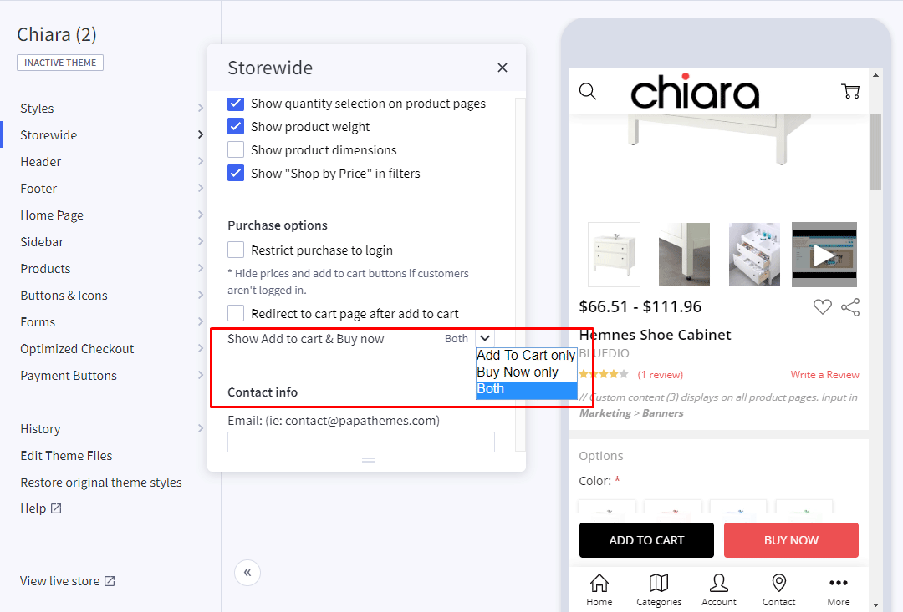


## Product page settings

Configure settings for product pages in **Theme Editor** > **Products**.


## Infinite product loading

Theme support infinite product loading or infinite scroll on category pages, brand pages and search results pages. It is automatically enabled by default. You can configure this option in **Theme Editor** > **Products** > **Infinite Scroll**:

* **Category pages**
* **Brands pages**
* **Brand pages**
* **Search pages**


## Product Card & Color Swatches


Configure how products display on listing in **Theme Editor** > **Products** > **Product cards**:

* **Product title color & hover color**.
* **Button text color & background color**.
* **Show brand**
* **Show color swatches**: To display color swatches for product options with type "Swatches".


## Bottom bar on mobile

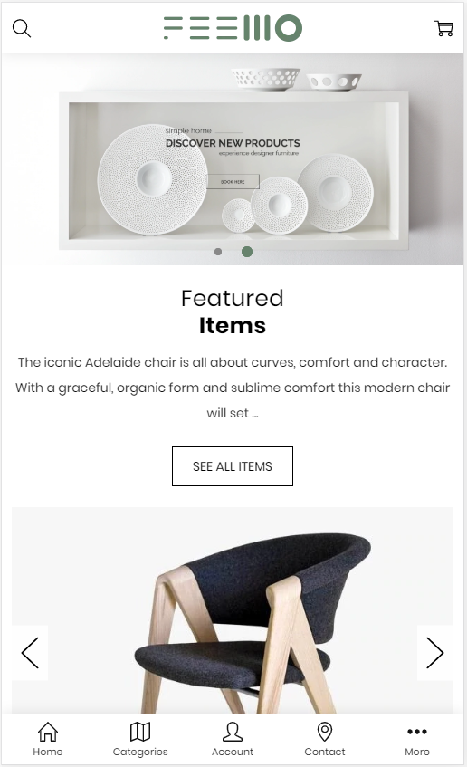

Configure this bottom bar in **Theme Editor** > **Footer** > **Bottom bar on mobile**:

* **Background color**
* **Text color**
* **Active color**
* **Icon size**
* **Font size**
* **Show Shop by Brands in Store panel**: Display "Show by Brands" link in the menu panel when lick on the Store icon.

### Contact info

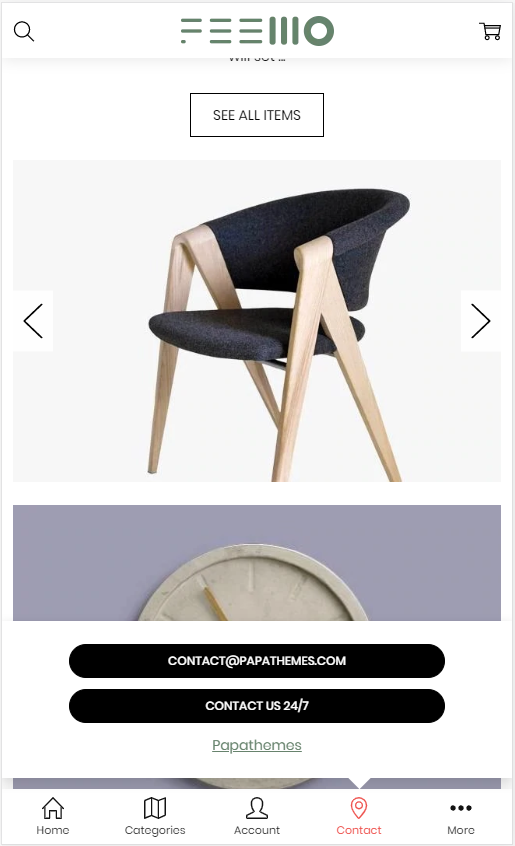

Configure contact info to display when click the Contact icon in **Theme Editor** > **Storewide** > **Contact info**:

* **Email**
* **Phone number**
* **Call text**
* **Contact page URL**
* **Contact link text**

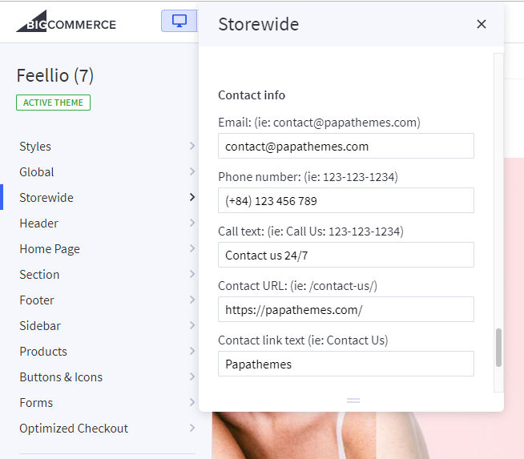

