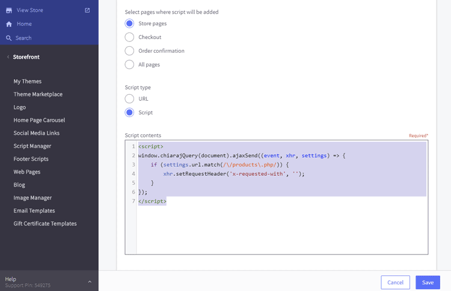
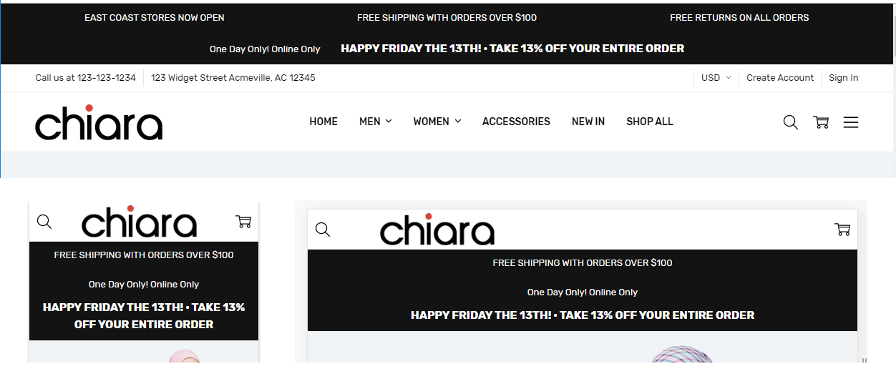
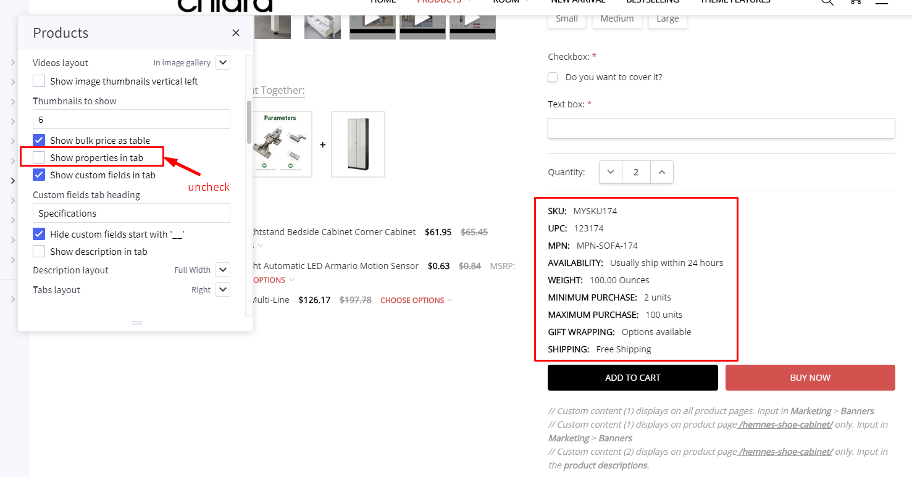

# FAQs

## Change text of BUY button on the product page on mobile

Add this custom code below into your **Storefront** > **Footer Scripts**:

```html
<style>
.productView-options-toggle { width: 110px; border-radius: 3px; }
.productView-options-toggle .on { font-size: 0; }
.productView-options-toggle .on:before { font-size: 12px; content: 'Customize'; }
</style>
```

Where `Customize` is an example text to change.


## Display the product options on the product page on mobile

To display the product options on the product page on mobile instead of having to click BUY button, add the code below into **Storefont** > **Footer Scripts**:

```html
<style>
@media (max-width: 800px) {
.productView-options-toggle { display: none }
.productView-options-content { position: static; right: 0; opacity: 1; box-shadow: none; border-top: 1px solid #ddd}
.productView-options-panel-body { position: static; padding-bottom: 0px; }
.productView-options-panel-heading ~ .mobile-panel-close { display: none; }
.productView-options-content .form-action { position: static; right: auto; }
.productView-options-panel-heading { display: none }
.productView-options { order: 6; }
}
</style>
```

## Hide the "Home" link on the main menu

Add the custom code below into **Storefront** > **Footer Scripts**:

```html
<style>
#navPages-main > .navPages-item:first-child { display: none }
</style>
```


## Fix Products Bought Together stop working after BigCommerce API changed

If you suddenly get a problem that the products also bought together stop working on your product pages. 
That is because BigCommerce has changed the content type of product ajax request.

To workaround this issue while waiting for the fix from BigCommerce or the theme update, please follow
this instruction.

Login to your store admin panel, go to **Storefront** > **Script Manager** > click on the button **Create a Script**.

Input:

- **Name of Script**: `Fix Also Bought Products stop working after BC API changed` or whatever.
- **Location of page**: `Footer`
- **Select pages where script will be added**: `Store pages`.
- **Script type**: `Script`.
- **Script contents**:

```html
<script>
window.chiarajQuery(document).ajaxSend((event, xhr, settings) => {
	if (settings.url.match(/\/products\.php/)) {
		xhr.setRequestHeader('x-requested-with', '');
	}
});
</script>
```

Then click **Save** button.

Your script should look like this screenshot:




## Add custom text on the orders page


Add the code below to **Storefront** > **Script Manager**:

```html
<script>
(function($) {
    if ($('body').is('.page-type-account_orderstatus, .papaSupermarket-pageType--account-orderstatus')) {
        $('.account').before('<p style="font-size:large;text-align:center">Click on the Order # to go to your download links</p>');
    }
})(window.jQuerySupermarket || window.chiarajQuery || window.jQuery);
</script>
```

Choose location = **Footer**.


## Collapse product description tab by default on product pages

Add the code below to **Storefront** > **Script Manager** at Footer position:

```html
<script>
(function($) {
    $('.productView-tab--description.is-active, .productView-desc.is-active').removeClass('is-active');
})(window.chiarajQuery || window.$);
</script>
```


## Make responsive top banner



Add the custom CSS below to **Storefront** > **Footer Scripts** or add to file `assets/scss/_chiara-custom.scss` if you prefer to edit theme files:

```html
<style>
.list-unstyled { display: block; list-style: none; margin: 0; padding: 0; }
.font-size-larger { font-size: larger }

@media (min-width: 801px) {
    .flex-desktop { display: flex }
    .flex-desktop > * { flex: 1 }
    .display-inline-desktop { display: inline }
    .ml-2-desktop { margin-left: 2rem }
}

@media (max-width: 550px) {
    .hide-mobile { display: none }
}

@media (min-width: 551px) and (max-width: 800px) {
    .hide-tablet { display: none }
}
</style>
```


### Banner 1

Create a new banner, open HTML source editor and add the code below:

```html
<ul class="list-unstyled flex-desktop">
    <li class="hide-mobile hide-tablet">EAST COAST STORES NOW OPEN</li>
    <li>FREE SHIPPING WITH ORDERS OVER $100</li>
    <li class="hide-mobile hide-tablet">FREE RETURNS ON ALL ORDERS</li>
</ul>
```

The banner will shows 3 column on desktop. On mobile and tablet, only "FREE SHIPPING WITH ORDERS OVER $100" is displayed.

CSS class explanation:

- `list-unstyled`: use to reset the UL element.
- `flex-desktop`: allow UL show as flex layout (columns) on desktop.
- `hide-mobile`: hide the element on mobile.
- `hide-mobile`: hide the element on tablet.


### Banner 2

Create a new banner, open HTML source editor and add the code below:

```html
<div>
    <p class="display-inline-desktop">One Day Only! Online Only</p>
    <p class="display-inline-desktop font-size-larger ml-2-desktop"><strong>HAPPY FRIDAY THE 13TH! · TAKE 13% OFF YOUR ENTIRE ORDER</strong></p>
</div>
```
The banner will shows 2 rows on mobile and tablet, but 1 row on desktop. Text "HAPPY FRIDAY THE 13TH! · TAKE 13% OFF YOUR ENTIRE ORDER" will have larger font size.

CSS class explanation:

- `display-inline-desktop`: display inline (same row) on desktop.
- `font-size-larger`: allow font size larger.
- `ml-2-desktop`: have a margin left 2rem on desktop.


## Show all the main navigation's items without (...) icon

Add the custom code below to **Storefront** > **Script Manager**, choose **Page** = `All Pages` and **Location** = `Footer`:

```html
<script>
if (!window.chiaraSettings) window.chiaraSettings = {};
window.chiaraSettings.disableAutoSizeNavPages = true;
</script>
```


## Move product properties to show before Add to Cart button on PDP



Add the custom code below to **Storefront** > **Script Manager**, choose **Page** = `All Storefront Pages` and **Location** = `Footer`:

```html
<script>
(function($) {
    var $el = $('.productView-info--desktopOnly').css('margin-top', '1rem');
    $('.productView-options-content .form-action-group').before($el);
})(window.chiarajQuery || window.$);
</script>
```
