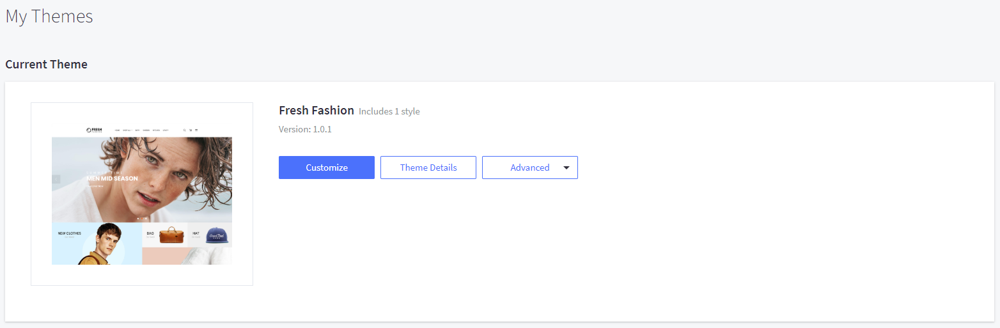
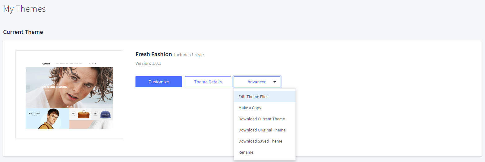
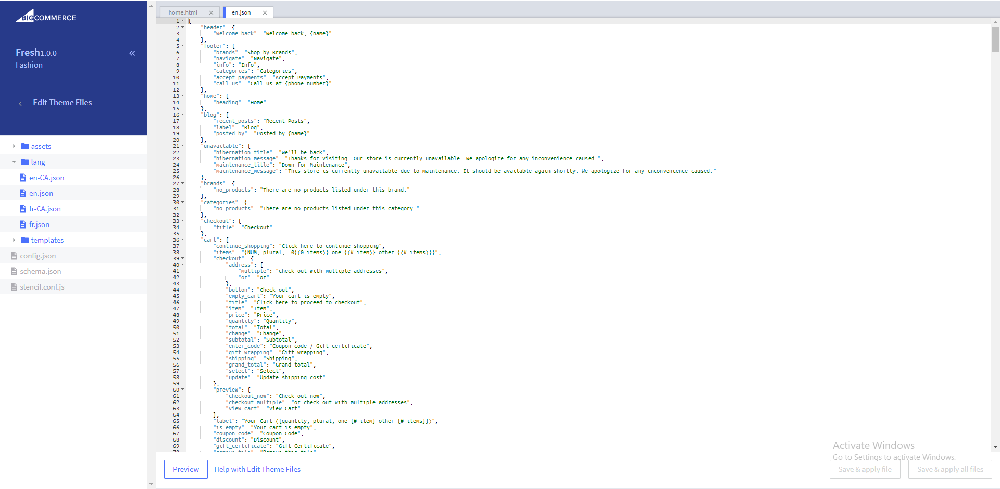
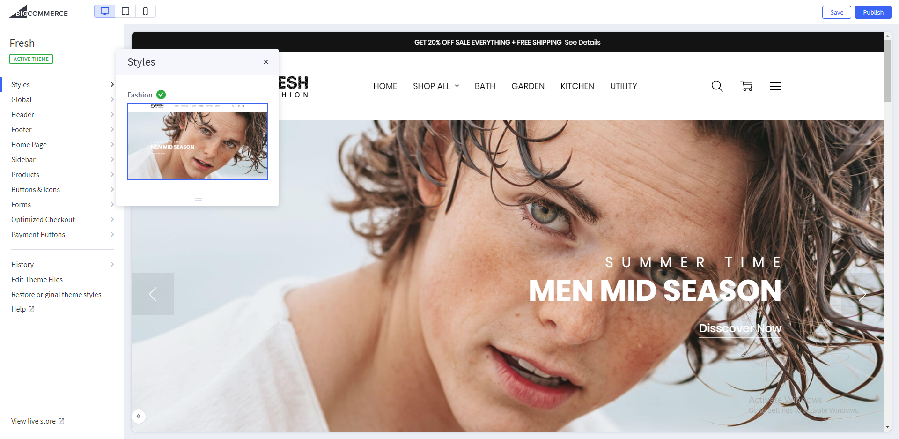
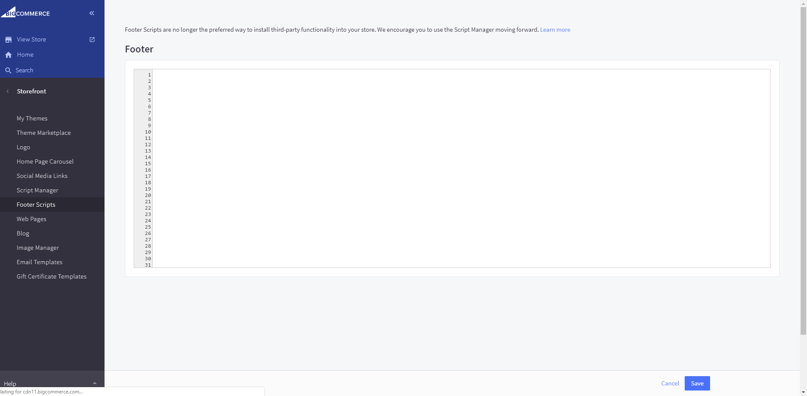
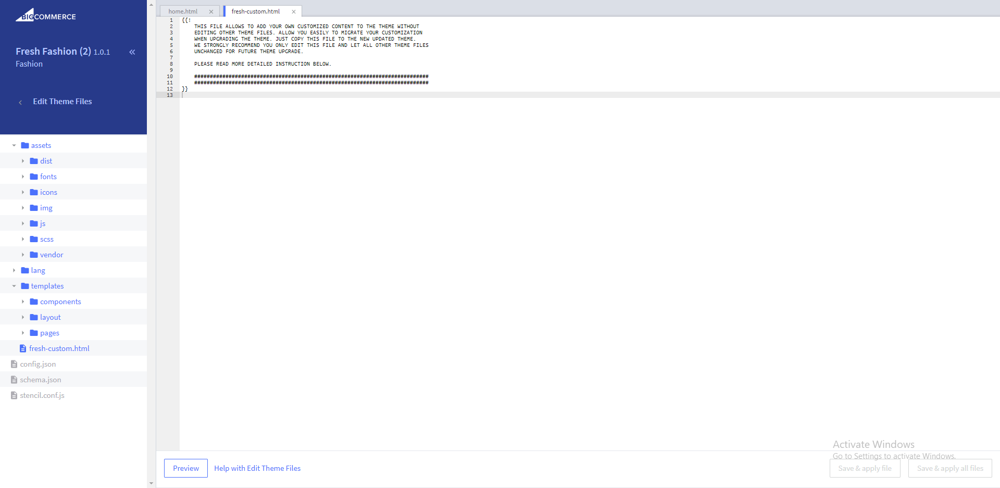

# Quick Start Guide

Theme is customizable and editable via:

1. Theme Editor
2. Template files
3. Language files

## Theme Editor

This theme provides a powerful Theme Editor with many options let you change styles, colors, fonts and more.

To access the Theme Editor, go to your admin page > __Storefront Design__ > __My Themes__, on the Current Theme section, click __Customize__ button:

## Edit language file

Language files contains hard-coded static text, images and other links, which can be edited and translated to any languages.

To edit the language file, go to admin page > __Storefront Design__ > __My Themes__, click button __Advanced__ > __Edit Theme Files__ of the current theme:

From the left navigation, click to edit the language file (e.i `en.json`):

## Edit template files

Edit template files is __not recommended__, unless you have HTML, CSS and Sass programming skills.

You can edit the HTML files, SCSS files, images. However remember to __backup your changed files__ as they are overwritten when you upgrade the theme.

To edit the template files, go to admin page > __Storefront Design__ > __My Themes__, click button __Advanced__ > __Edit Theme Files__ of the current theme:

- All HTML files are in directory `templates`.
- All Sass files are in directory `assets / scss`.
- Images are placed in directory `assets / img`.

## Activate a theme style

To activate a theme style, open Theme Editor, find __Styles__ section, click on the theme variation's thumbnail to activate corresponding style.

## Edit source code

### Add your own CSS / SCSS:

- **Option 1:** Edit file `assets/scss/fresh-custom.scss`
- **Option 2:** Add custom CSS  in `` into **Storefront** > **Footer Scripts**.

### Add your own Javascript:

- **Option 1:** Add custom JS in `` into **Storefront** > **Footer Scripts**.
- **Option 2:** Add custom JS into **Storefront** > **Scripts Manager**.

### Edit HTML:

ONLY edit file `templates/fresh-custom.html`

