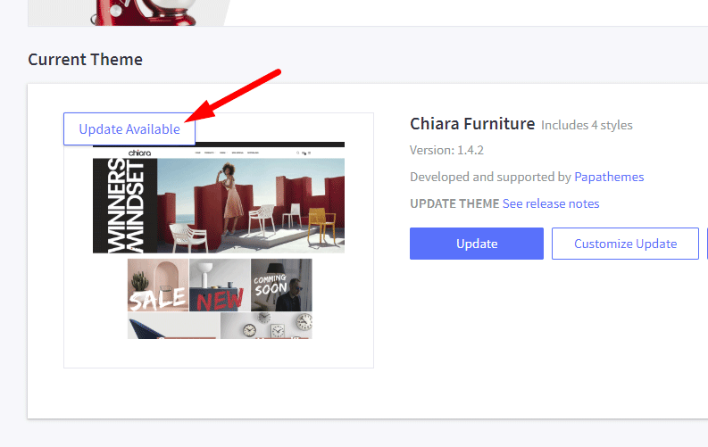
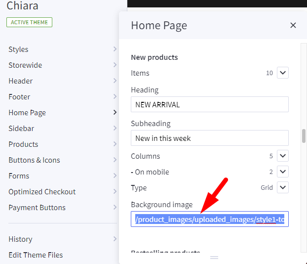

# How to update Fresh theme

Log into your admin panel, go to **Storefront** > **My Themes** > click **Update Available** button appears on the theme thumbnail.

## Update a customized (or edited theme files) theme

If your theme files have been edited and you are not using the original theme, you need to update the original theme and redo your customization on the new updated theme again.

1. Click Update button on the original theme to update your original theme.
2. Make a copy of the new updated theme in order to edit theme files.
3. Redo your customization or migrate your custom code to the new copied theme.
4. Verify the new theme work properly in the preview.
5. Apply your new theme to live.

## Additional note for updating 1.4 to 1.5

If you're updating your theme to version 1.5, you may need to update some theme settings manually.

If your New Products, Bestselling Products or Featured Products doesn't have background image previously, you may need to remove the default images from Theme Editor. Open **Theme Editor** > **Home Page** > **New Products** > Delete the default image in **Background image** text box. Same for Bestselling Products and Featured products.

## How to revert the ealier version

To restore the ealier version, Check this [instruction](https://support.bigcommerce.com/s/article/Marketplace-Theme-Updates#restore) or watch the video below:

<iframe width="560" height="315" src="https://www.youtube.com/embed/eZdmudDUrQE" frameborder="0" allow="accelerometer; autoplay; encrypted-media; gyroscope; picture-in-picture" allowfullscreen></iframe>

